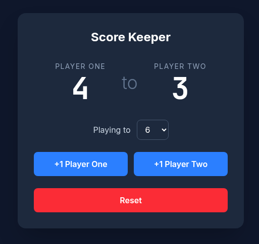

# Score Keeper

A ping pong score keeper built with React, TypeScript, Vite and Tailwind CSS. Track points for two players, choose the winning score, and reset the match at any time.



## Running locally

```bash
npm install
npm run dev